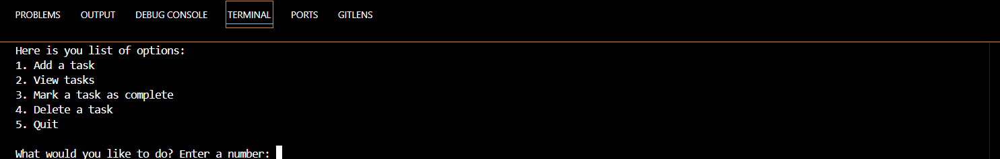
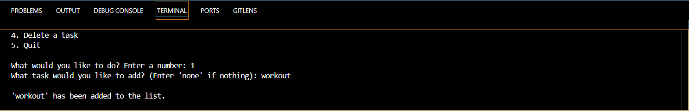
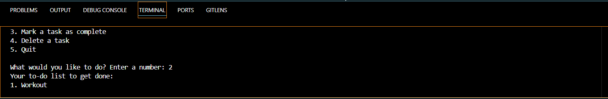
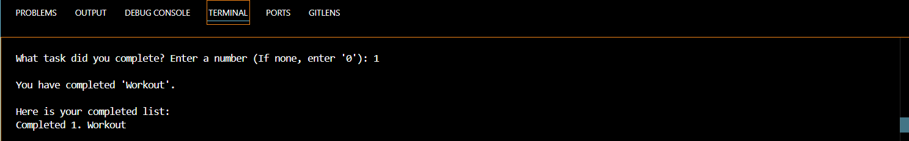
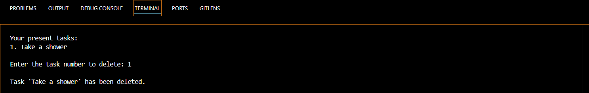

# A Simple To-Do List App

A simple to-do app that allows users to add, view, mark complete or delete tasks.

-------------------------------------------

## Features

**Add Tasks**: Add new tasks to your to-do list.
**View Tasks**: View the list of tasks that need to be done.
**Mark Tasks as Complete**: Mark a task as completed and move it to the completed tasks list.
**Delete Tasks**: Delete tasks from the to-do list.
**Completed Tasks** Overview: View a list of completed tasks.
**User-Friendly Prompts**: Handles invalid inputs gracefully with error messages.

-------------------------------------------

## Requirements

**Python 3.12.8**

-------------------------------------------

## How to Run

1. Clone or download this repository to your local machine.
2. Open a terminal or command prompt and navigate to the folder containing the script.
3. Run the program using the command:

    bash

    python 2doList.py

-------------------------------------------

## How to Use

When you run the program, you’ll see a menu with the following options:

-------------------------------------------

## Main Menu

1. Add a task
2. View tasks
3. Mark a task as complete
4. Delete a task
5. Quit

-------------------------------------------

**Add a Task**: Type <u>1</u> to add a new task to your to-do list. Follow the prompts to provide a task description.
**View Tasks**: Type <u>2</u> to view the current tasks in your to-do list.
**Mark a Task as Complete**: Type <u>3</u> to mark a task as completed. Choose the task number from the displayed list.
**Delete a Task**: Type <u>4</u> to delete a task. Choose the task number to remove it from the list.
**Quit**: Type <u>5</u> to exit the application.

-------------------------------------------

## Code Overview

### Functions
- **add_task()**: Adds a task to the to-do list.
- **view_task()**: Displays the current tasks.
- **task_complete()**: Marks a task as complete and moves it to the completed tasks list.
- **del_task()**: Deletes a task from the to-do list.

-------------------------------------------

## Example Interaction

**1. Add Task**:
What task would you like to add? (Enter 'none' if nothing): Workout
'Workout' has been added to the list.

**2. View Task**:
Your to-do list to get done:
1. Workout

**3. Mark Task Complete**:
What task did you complete? Enter a number (If none, enter '0'): 1
You have completed 'Workout'.

Here is your completed list:
Completed 1. Workout

**4. Delete a Task**:
Enter the task number to delete: 1
Task 'Workout' has been deleted.

-------------------------------------------

## Error Handling

the app handles:

- non-numeric inputs for task selection (Enter letters and words).
- Out of range task numbers.
- Attempting to mark or delete tasks from an empty list.

-------------------------------------------

## Future Improvents

- Add feature(s) to any of the program.
- Allow editing to the entire program.

-------------------------------------------

